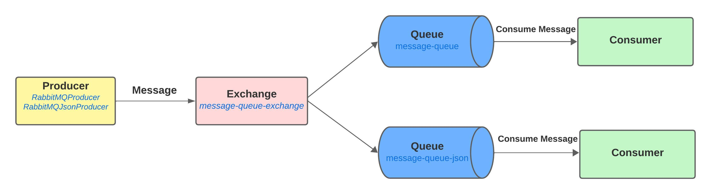

# Message Service

This is a microservice application which is expose below mentioned operations with integration of RabbitMQ.

1. Push single message to queue.
2. Push json message to queue.
3. Consume single message from queue.
4. Consume json message from queue.

# RabbitMQ Architecture and Overview

You can go through with [RabbitMQ documentation](https://www.rabbitmq.com/) for get some knowledge.

This microservice is created using below mentioned technologies stack.

1. Spring Boot 3.0.10-RELEASE
2. Spring lombok
3. Spring AMQP
4. RabbitMQ 3-management
5. Docker - version 24.0.5

Below display the simple architecture.

## Getting started

Flow the below steps for play with RabbitMQ.

1. Install Docker.
Follow the [Docker Documentation](https://docs.docker.com/engine/install/) for download and install docker.

2. Pull RabbitMQ docker image from Docker Hub. Follow the [RabbitMQ Docker Image](https://hub.docker.com/_/rabbitmq). Make sure to use management version (Ex :- 3-management).

3. Run the docker image of rabbitmq and start the container.

`docker run --rm -it -p 15672:15672 -p 5672:5672 rabbitmq:3-management`

4. Clone the project to your working directory.

Clone with HTTPS : https://gitlab.com/lakshitha-gw/lucky7-microservices/message-service.git

Clone with SSH : git@gitlab.com:lakshitha-gw/lucky7-microservices/message-service.git

5. Build the artifacts using maven.

- Go inside the message-service project - `cd message-service`

- Download the artifacts using maven - `mvn clean install`

6. Start the Spring Boot application.

- Go inside the target folder which is created with jar file - `cd message-service/target`

- Start the application using jar file in command line - `java -jar message-service-1.0.0-RELEASE.jar`
